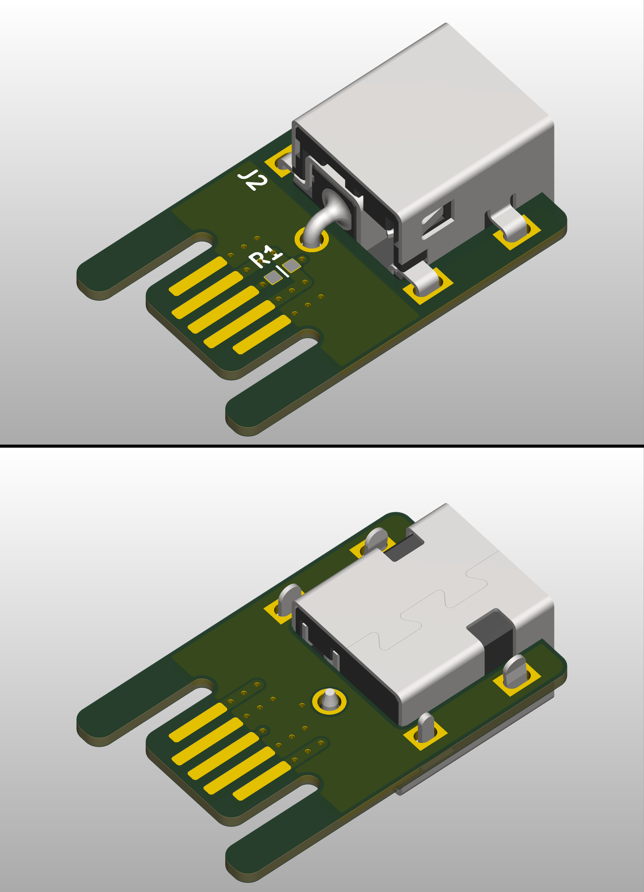
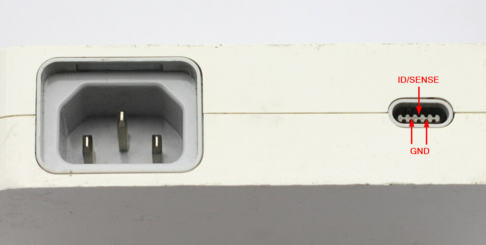
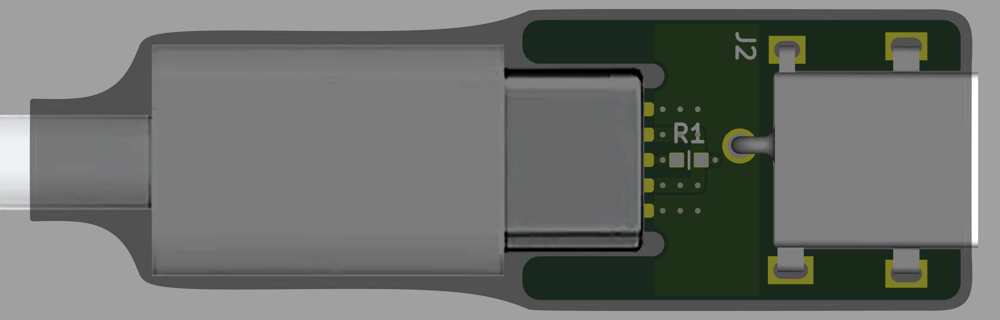

# Apple Cinema Display Barrel Jack Adapter

## Overview
This is an adapter board that facilitates connection of the 20” (A1081), 23” (A1082) and 30” (A1083) Apple Cinema Displays to off-the-shelf/third-party power supplies with a barrel jack (5.5OD/2.1ID or 5.5OD/2.5ID).

## Disclaimer
The information contained in this repository has been generated via reverse-engineering of publicly available material, and is provided without warranty or guarantee of accuracy. [The Electron Vault](https://www.theelectronvault.com/) is not responsible for any losses or damages caused to equipment as a consequence of the information contained in this repository or associated documents.

## KiCad Project Setup
### Database Library
This project uses a local database library for all components. As the library is linked to the project through relative pathing, it should just work once the ODBC driver is installed.
1) Install an ODBC driver. I use this one http://www.ch-werner.de/sqliteodbc/
2) [Optional] Install an SQLite database editor. I use SQLiteStudio https://sqlitestudio.pl

### Theme
This KiCad project has a number of thematic customisations. These are however completely optional and everything *should* work fine with the default theme. If you however wish to install the theme, here is the procedure:
1) Install KiCad as normal.
2) Copy PREF/color/Black and White.json from the repo into the corresponding folder in your KiCad preferences.
3) Launch KiCad and open Preferences -> Colors.
4) The Black and White theme should now be available in Schematic Editor -> Colors and PCB Editor -> Colors.
5) Schematic font: Arial

## Manufacturing
The repository includes manufacturing files in the MFG directory which can be used for ordering boards from any PCB manufacturer (PCBWay, JLCPCB, etc.). **At the time of this repo's publication, these boards have not been manufactured, so these files are provided without any warranty or guarantee.** A basic verification of the edge connector geometry was however done by milling out the pattern from blank 0.8mm copper clad using a desktop CNC engraver. 

All ordering information is provided in the User_Drawings gerber layer, and is also provided below for ease of ordering:

|Parameter          |Value |
|-------------------|------|
|Length             | 25mm |
|Width              | 16mm |
|Layers             | 2    |
|Finished Thickness | 0.8mm|
|Minimum Track/Space| 6mil |
|Minimum Hole/Drill | 0.3mm|

The board is designed to be as low cost as possible. As a point of reference, inputting the board specifications into PCBWay, at the time writing, a panel of 15 boards were estimated at USD $5 plus shipping on 24 hour turn. This pricing is with HASL finish, which should suffice for low cycle counts of the board edge connector (the part that plugs into the Display's power connector). If however you anticipate frequent plugging/unplugging of this adapter, specifying a hard gold finish for the contact fingers is recommened. This will however drive up cost substantially.

## Assembly
Though most Chinese board houses offer assembly services, given this board only has one component (plus an optional 0603 resistor), hand assembly is likely better suited. No BOM document has been generated given the simplicty. Instead, part numbers are provided in the table below:

|Designator |Part Number           | Notes                     |
|-----------|----------------------|---------------------------|
|J2         | 54-00253             | For 5.5OD/2.1ID           |
|           | JACK-C-SMT-10A-RA(R) | Alternate for 5.5OD/2.1ID |
|           | 54-00254             | For 5.5OD/2.5ID           |
|           | JACK-L-SMT-10A-RA(R) | Alternate for 5.5OD/2.5ID |
|R1         | DNF                  | For 150W indication       |
|           | TBD                  | For 90W indication        |
|           | TBD                  | For 65W indication        |

For most cases, R1 can be left unfitted (DNF). This will emulate the 150W power supply for the 30" Cinema Display, which will also work on the 20" and 23" models. **If you leave R1 unfitted but use a power supply rated below 150W, you are doing so at your own risk. If the supply is not well designed for handling overload, you may permanently damage it by connecting it to a panel that requires more power than it can supply**. If you wish to emulate one of the smaller (65W/90W) bricks to ensure a lower rating supply isn't mistakenly used by a larger monitor, you will need to determine the appropriate resistor to populate on R1. I was not able to find a good reference for what value these should be. You should be able to measure this off an original power adapter my measuring the resistance between ID/SENSE and one of the GND pins.

## Enclosures
I originally considered designing this board to fit into an off-the-shelf Hammond-style enclosure. However I couldn't see a viable way for the average person to achieve an acceptable result for the port cut outs, particularly for the edge connector where alignment is critical to minimise risk of damage to the mating plug. I also considered making these front panels out of PCB material (can breakaway from the adatper board panel), however I couldn't find any enclosures that would work with this solution. Plus, it just made assembly more finicky.

In the end I opted for this bare board solution that plugs directly into the cable. To protect the board (and also firmly secure it to the plug), I recommend applying heatshrink over the entire assembly as shown below:

If however someone wants to go the route of designing a printable enclosure, the 3D model for the board is provided in the STEP directory.