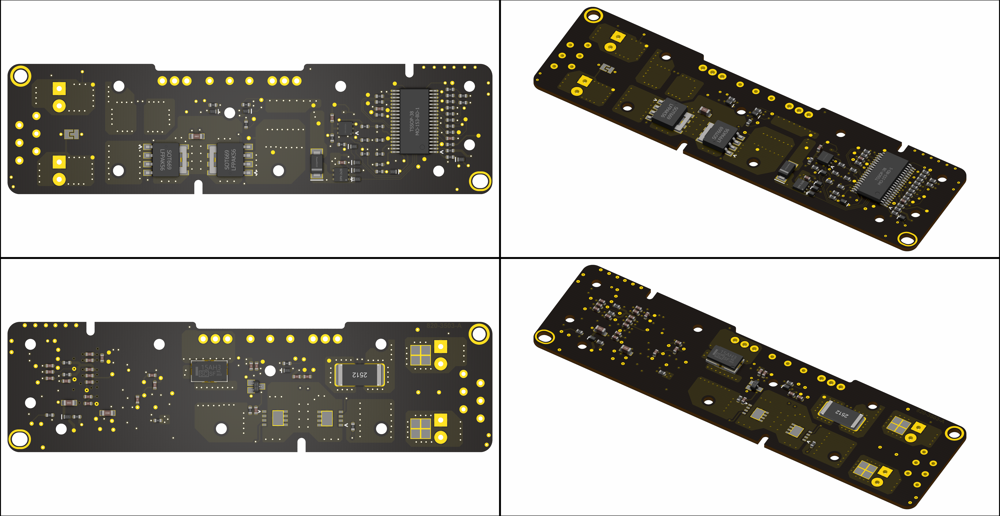
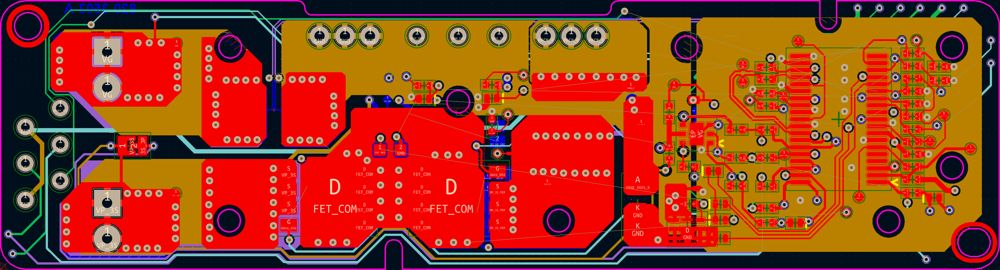
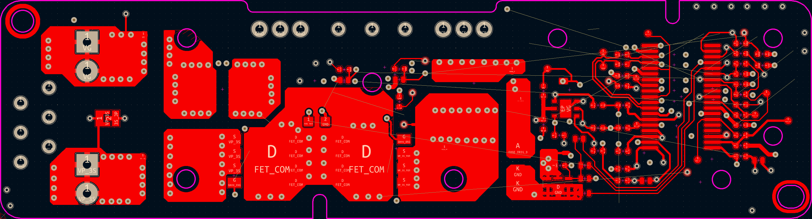
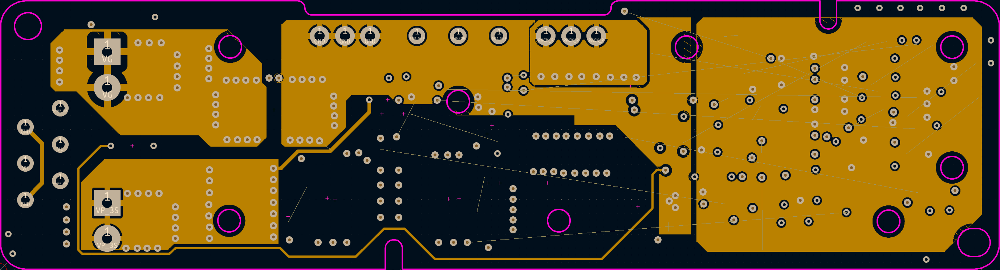
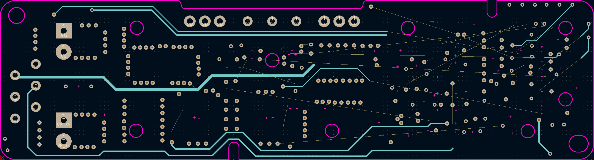
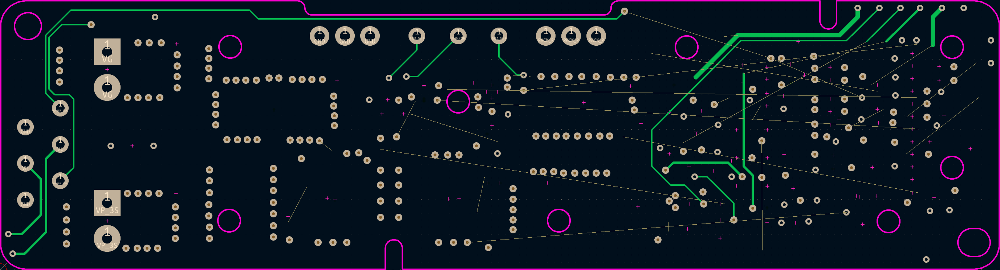
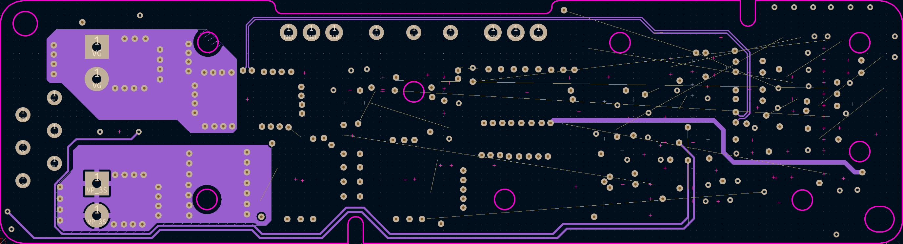
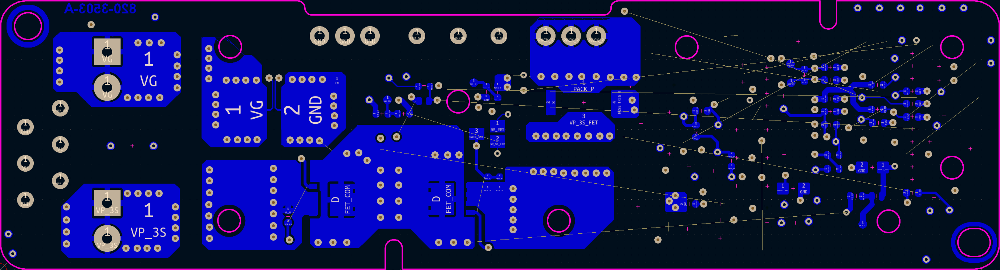

# 820-3503 A1493, A1582 BMS Board

## Overview
This is an open-source, KiCad-based 820-3503 PCBA that has been reverse-engineered from a physical board. This is the BMS used in the A1493 and A1582 battery packs for the 13" Retina MacBook Pro.

## Disclaimer
The information contained in this repository has been generated via reverse-engineering of publicly available material, and is provided without warranty or guarantee of accuracy. [The Electron Vault](https://www.theelectronvault.com/) is not responsible for any losses or damages caused to equipment as a consequence of the information contained in this repository or associated documents.

## Setup
### Database Library
This project uses a local database library for all components. As the library is linked to the project through relative pathing, it should just work once the ODBC driver is installed.
1) Install an ODBC driver. I use this one http://www.ch-werner.de/sqliteodbc/
2) [Optional] Install an SQLite database editor. I use SQLiteStudio https://sqlitestudio.pl

### Theme
This KiCad project has a number of thematic customisations. These are however completely optional and everything *should* work fine with the default theme. If you however wish to install the theme, here is the procedure:
1) Install KiCad as normal.
2) Copy PREF/color/Black and White.json from the repo into the corresponding folder in your KiCad preferences.
3) Launch KiCad and open Preferences -> Colors.
4) The Black and White theme should now be available in Schematic Editor -> Colors and PCB Editor -> Colors.
5) Schematic font: Arial

## Known Limitations
As this is a reverse-engineered design, there are several limitations potentially affecting accuracy that must be acknowledged:
- **This board is not ready for production.** The intent was to make it visually accurate enough to assist with troubleshooting, repair, or as a reference design to facilitate the design of drop-in replacements or other similar projects. OpenBoardView (Landrex-BRD) compatible files (generated using [kicad-boardview](https://github.com/whitequark/kicad-boardview) exporter) are provided in the repo along with PDF schematics.
	- Component placement is only photographically accurate - there may be mechanical interferences.
	- Board outline is best-effort. Use at your own risk.
	- Some effort has been made to recover the board stackup. A partial section view can be found in DOC\Stackup.jpg. Initially it was thought to be a 4-layer stackup, however after backlit inspection, it is more likely 6. The dielectric thickness surrounding the innermost two layers was not able to be recovered, however the laminated gap beneath the top and bottom layers appears to be approximately 110um.
	- All routing is best-effort **and incomplete**, primarily as a checklist aid/sanity check that nets have been assigned to the correct components. There are missing elements such as internal planes/poly-pours.
	- Trace widths are purely photographically scaled.
- Passive component (resistors, capacitors) values were measured with an LCR meter and rounded to the nearest standard value. Accuracy is not guaranteed.
- There is a component between the power path MOSFETs that's presumed to be an NTC due to how its resistance changes (decreases) when heated. The placement location also leads credence to this assumption. The measured resistance at 'room' temperature is approximately 28.9kOhms, so it is captured in the schematic/BOM as a 30kOhm NTC. The exact part number is however unknown.
- The NXP PH1530CL power path MOSFETs are EOL and thus a datasheet could not be found (Internet Archive and other similar services were consulted). The Digi-Key listing however does indicate a 30V VDS in the description. Based on the SCR fuse rating, the drain current can be no less than 15A. If replacements are required for repairs, this should provide a starting point.
