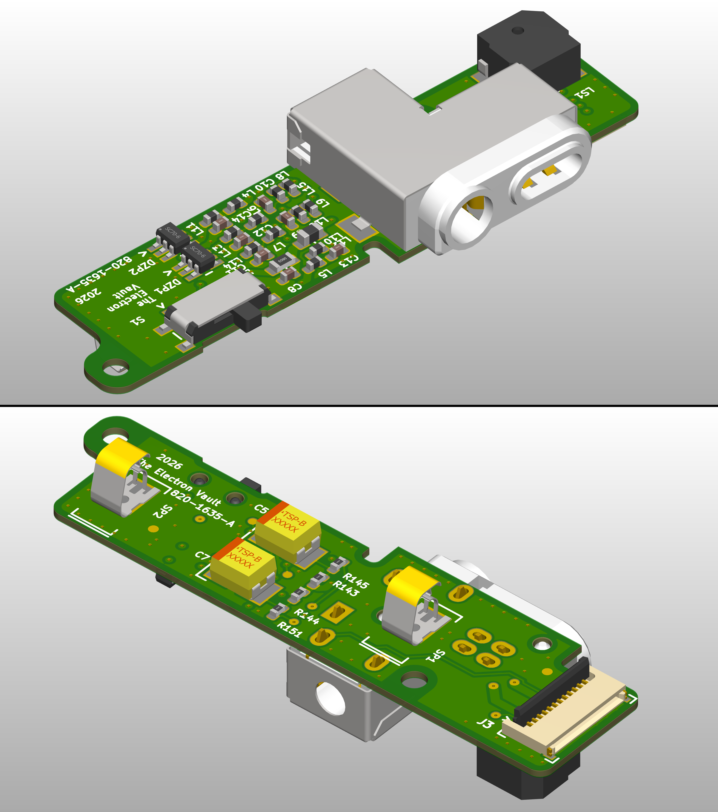
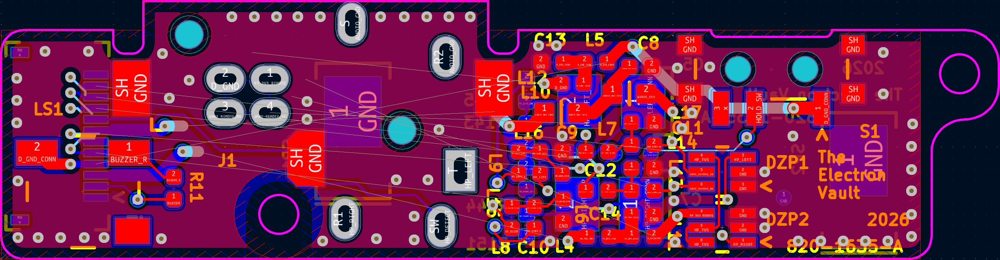
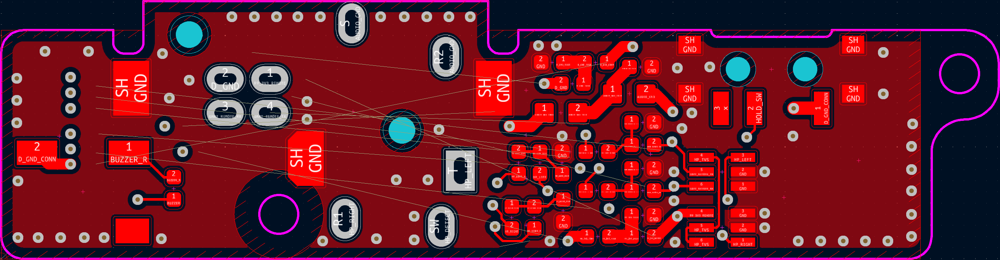
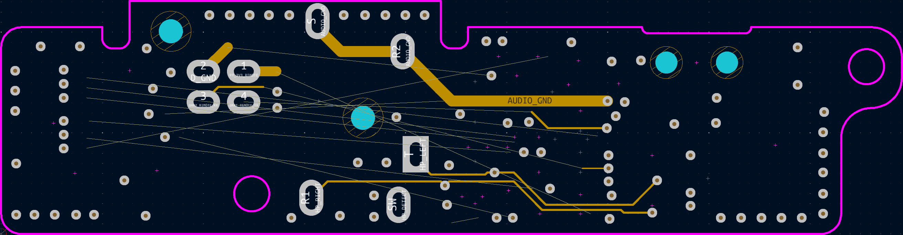
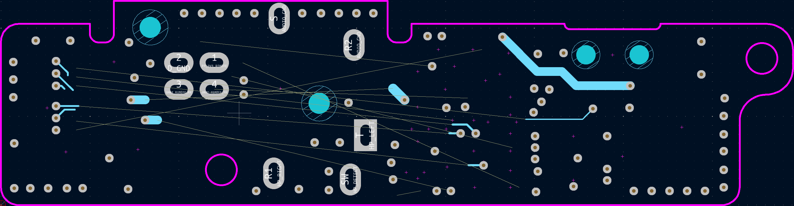
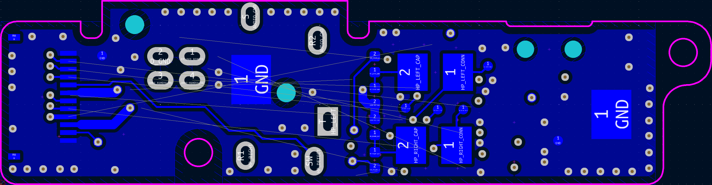

# 820-1635 iPod 4th Generation (Monochrome) Headphone/Hold Switch Board

## Overview
This is an open-source, KiCad-based 820-1635 PCBA that has been reverse-engineered from a physical board. This is the Headphone Jack and Hold Switch board used in the 4th Generation Monochrome iPod.

## Disclaimer
The information contained in this repository has been generated via reverse-engineering of publicly available material, and is provided without warranty or guarantee of accuracy. [The Electron Vault](https://www.theelectronvault.com/) is not responsible for any losses or damages caused to equipment as a consequence of the information contained in this repository or associated documents.

## Setup
### Database Library
This project uses a local database library for all components. As the library is linked to the project through relative pathing, it should just work once the ODBC driver is installed.
1) Install an ODBC driver. I use this one http://www.ch-werner.de/sqliteodbc/
2) [Optional] Install an SQLite database editor. I use SQLiteStudio https://sqlitestudio.pl

### Theme
This KiCad project has a number of thematic customisations. These are however completely optional and everything *should* work fine with the default theme. If you however wish to install the theme, here is the procedure:
1) Install KiCad as normal.
2) Copy PREF/color/Black and White.json from the repo into the corresponding folder in your KiCad preferences.
3) Launch KiCad and open Preferences -> Colors.
4) The Black and White theme should now be available in Schematic Editor -> Colors and PCB Editor -> Colors.
5) Schematic font: Arial

## Known Limitations
As this is a reverse-engineered design, there are several limitations potentially affecting accuracy that must be acknowledged:
- **This board is not ready for production.** The intent was to make it visually accurate enough to assist with troubleshooting and repair. OpenBoardView (Landrex-BRD) compatible files (generated using [kicad-boardview](https://github.com/whitequark/kicad-boardview) exporter) are provided in the repo along with PDF schematics.
- Component placement is only photographically accurate - there may be mechanical interferences.
- Board outline is best-effort. Use at your own risk.
- Board stackup is best effort; likely 4-layer.
- All routing is best-effort **and incomplete**, primarily as a checklist aid/sanity check that nets have been assigned to the correct components. There are missing elements such as internal planes/poly-pours.
- Trace widths are purely photographically scaled.
- Passive component (resistors, capacitors) values were measured with an LCR meter and rounded to the nearest standard value. Accuracy is not guaranteed.
- Some effort was made to characterise ferrite beads. The VNA scans can be found in the DOC folder. The part numbers captured in the schematic are **equivalent substitutes based on these scans and provided without guarantee.**
- The original part numbers for the buzzer, spring contacts, and hold switch were not able to be identified and thus equivalent substitutes were used.
