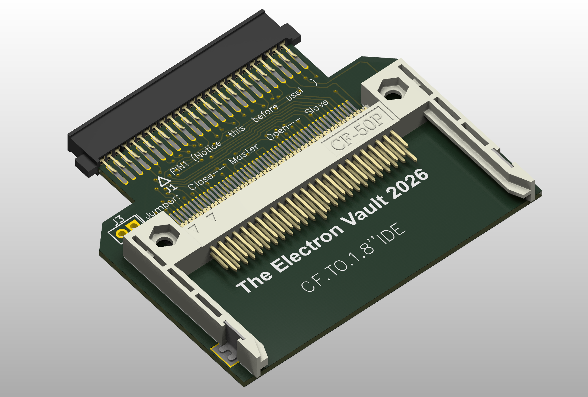
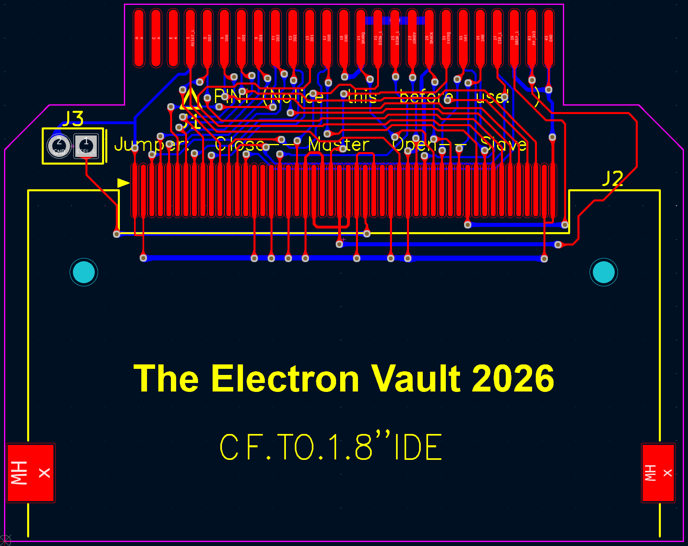
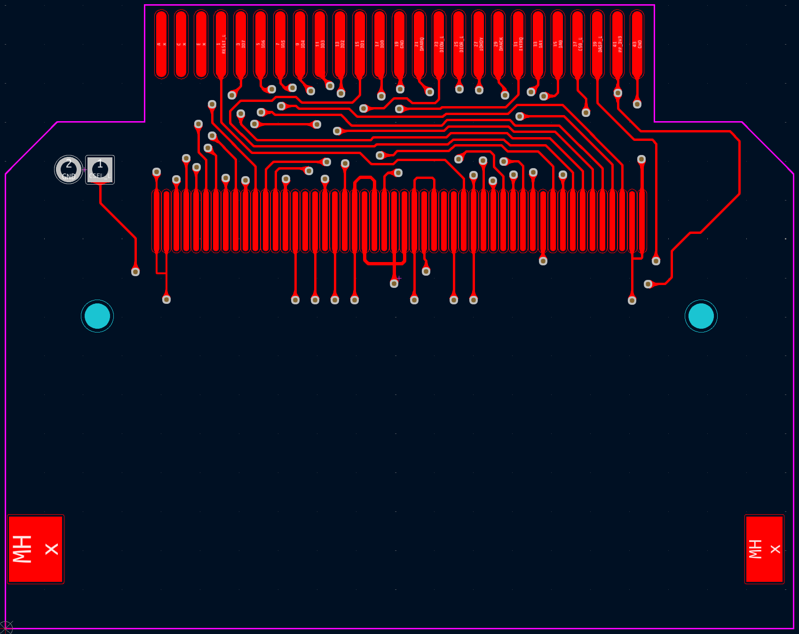
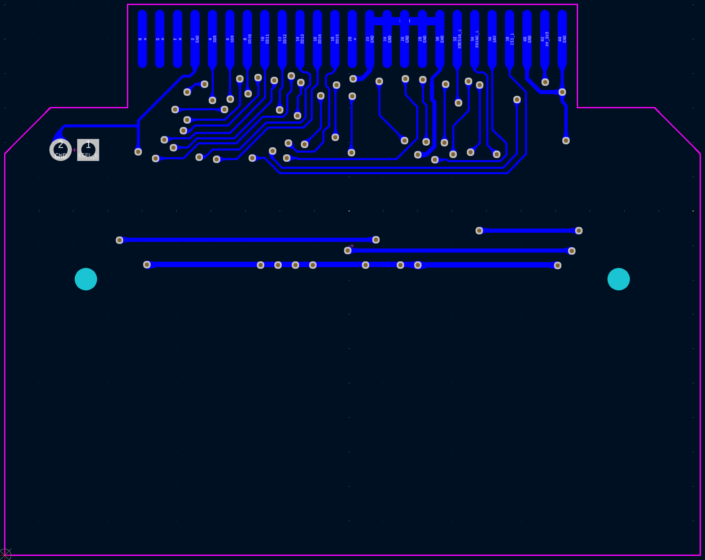

# HXSP-09FC69 1.8" IDE to CompactFlash Adapter

## Overview
This is an open-source, KiCad-based 1.8" IDE to CompactFlash Adapter PCBA that has been reverse-engineered from a physical board. Though this is not an Apple part, it is included in this repository as it is frequently used when replacing the hard disk with a CompactFlash card on the 4th generation iPods (both Monochrome and Photo variants).

## Disclaimer
The information contained in this repository has been generated via reverse-engineering of publicly available material, and is provided without warranty or guarantee of accuracy. [The Electron Vault](https://www.theelectronvault.com/) is not responsible for any losses or damages caused to equipment as a consequence of the information contained in this repository or associated documents.

## Setup
### Database Library
This project uses a local database library for all components. As the library is linked to the project through relative pathing, it should just work once the ODBC driver is installed.
1) Install an ODBC driver. I use this one http://www.ch-werner.de/sqliteodbc/
2) [Optional] Install an SQLite database editor. I use SQLiteStudio https://sqlitestudio.pl

### Theme
This KiCad project has a number of thematic customisations. These are however completely optional and everything *should* work fine with the default theme. If you however wish to install the theme, here is the procedure:
1) Install KiCad as normal.
2) Copy PREF/color/Black and White.json from the repo into the corresponding folder in your KiCad preferences.
3) Launch KiCad and open Preferences -> Colors.
4) The Black and White theme should now be available in Schematic Editor -> Colors and PCB Editor -> Colors.
5) Schematic font: Arial

## Known Limitations
As this is a reverse-engineered design, there are several limitations potentially affecting accuracy that must be acknowledged:
- **This board is not ready for production.** The intent was to make it visually accurate enough to assist with troubleshooting, repair, and also for documenting the FPC pinout for any other projects that need it.
- Component placement is only photographically accurate - there may be mechanical interferences.
- Board outline is best-effort. Use at your own risk.
- The LED and resistor has been omitted because it's not critical; it just flashes with activity (DASP signal).
- The routing is *in theory* complete but provided without warranty.
- Trace widths are purely photographically scaled.
- No DRCs have been run on layout.
