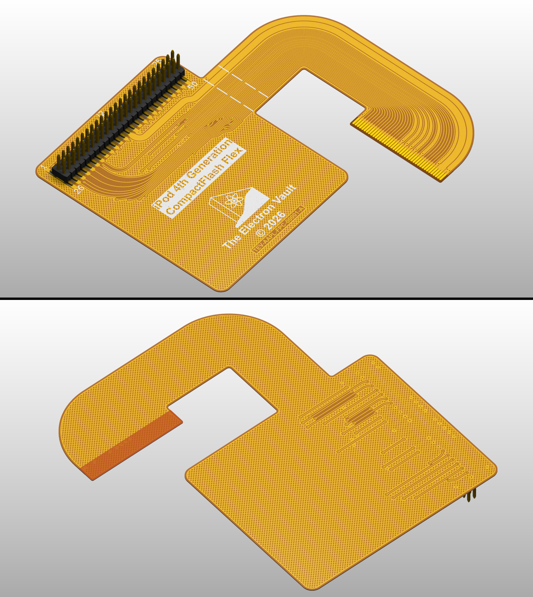
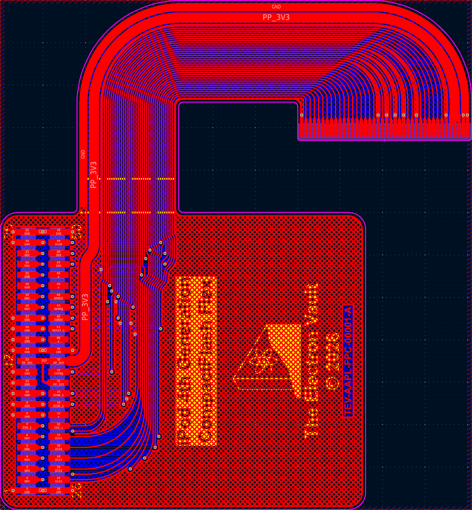
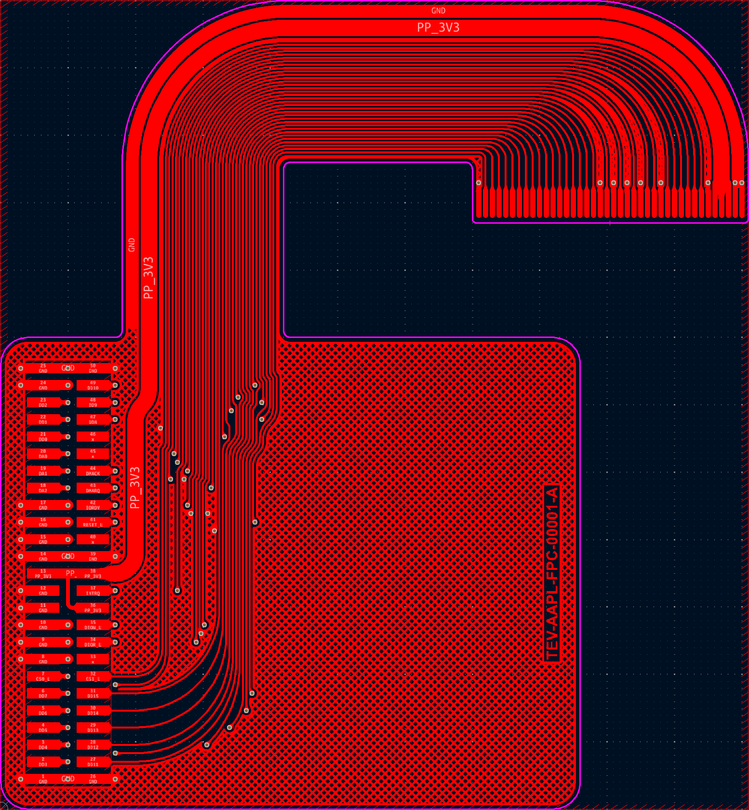
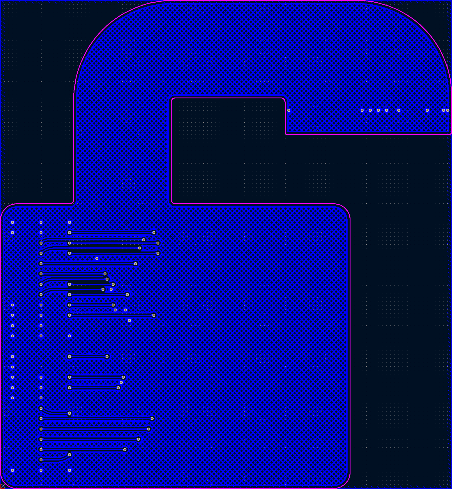
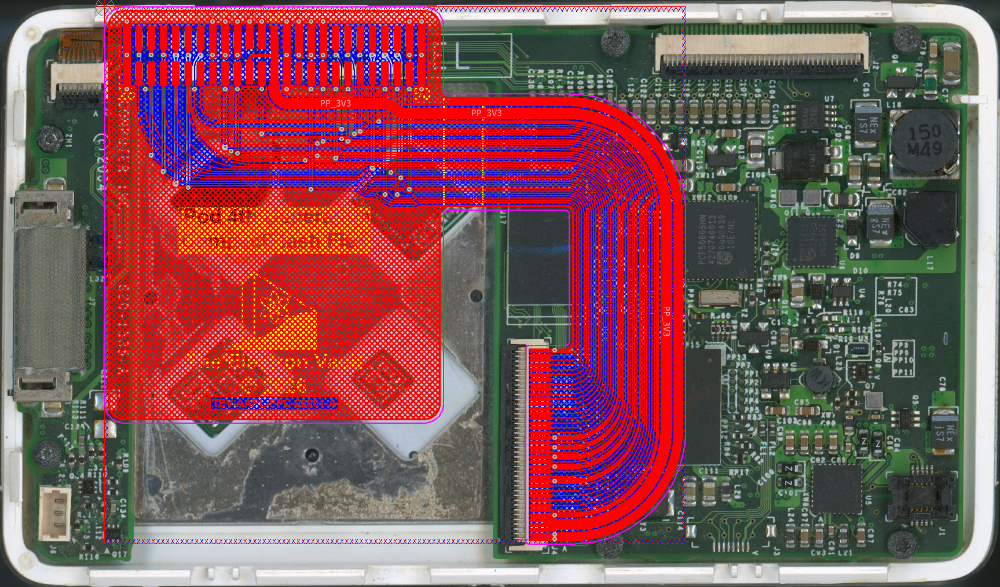
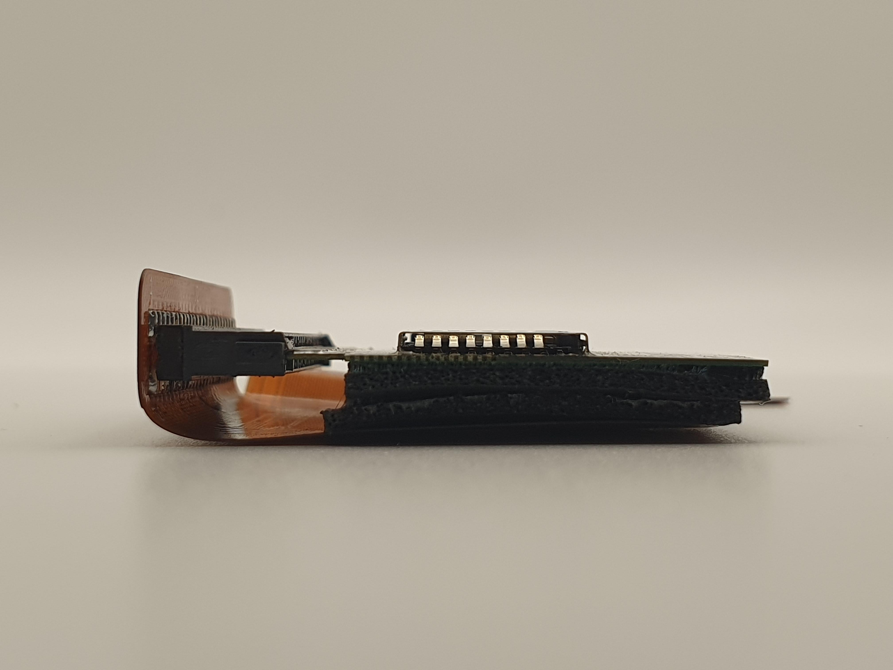
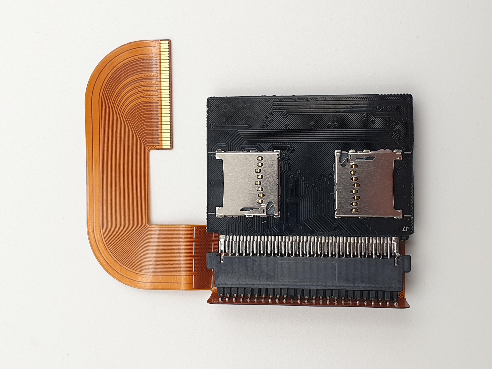

# TEV-AAPL-FPC-00001 iPod 4th Generation CompactFlash Flex

## Overview
This is an open-source, KiCad-based 40-pin FPC to CompactFlash flex cable for the 4th generation iPod (suitable for both Monochrome and Photo variants). It is made available free of charge under the GPL v3 license (see LICENSE), though if you find the work useful and wish to donate to show your appreciation, you may do so via [buymeacoffee](https://buymeacoffee.com/theelectronvault).

## Disclaimer
The information contained in this repository has been generated via reverse-engineering of publicly available material, and is provided without warranty or guarantee of accuracy. [The Electron Vault](https://www.theelectronvault.com/) is not responsible for any losses or damages caused to equipment as a consequence of the information contained in this repository or associated documents.

## Setup
### Database Library
This project uses a local database library for all components. As the library is linked to the project through relative pathing, it should just work once the ODBC driver is installed.
1) Install an ODBC driver. I use this one http://www.ch-werner.de/sqliteodbc/
2) [Optional] Install an SQLite database editor. I use SQLiteStudio https://sqlitestudio.pl

### Theme
This KiCad project has a number of thematic customisations. These are however completely optional and everything *should* work fine with the default theme. If you however wish to install the theme, here is the procedure:
1) Install KiCad as normal.
2) Copy PREF/color/Black and White.json from the repo into the corresponding folder in your KiCad preferences.
3) Launch KiCad and open Preferences -> Colors.
4) The Black and White theme should now be available in Schematic Editor -> Colors and PCB Editor -> Colors.
5) Schematic font: Arial

## Manufacturing
The repository includes manufacturing files in the MFG directory which can be used for ordering boards from any PCB manufacturer (PCBWay, JLCPCB, etc.). 

All ordering information is provided in the User_Drawings gerber layer, and is also provided below for ease of ordering:

|Parameter                           |Value       |
|------------------------------------|------------|
|Length                              | 60mm       |
|Width                               | 55.5mm     |
|Layers                              | 2 x 0.5 oz |
|Minimum Track/Space                 | 4mil       |
|Minimum Hole/Drill                  | 0.2mm      |
|Finished Flex Region Thickness      | 0.2mm      |
|Finished Stiffened Region Thickness | 0.25mm     |
|Stiffener Material                  | PI         |
|Coverlay Material                   | PI         |

Although the original Apple HDD flex cable (632-0259) uses HASL finish on the ZIF contacts, hard gold plating is recommended if high connection cycle counts are anticipated.

## Assembly
Though most Chinese board houses offer assembly services, given this board only has one component, hand assembly is likely better suited. No BOM document has been generated given the simplicity. Instead, part numbers are provided in the table below:

|Designator |Part Number  | Description                     |
|-----------|-------------|---------------------------------|
|J2         | 62105021021 | HEADER 1.27mm 2x25 WURTH WR-PHD |

Alternate headers from other manufacturers may also be fitted, provided they are the same pitch (1.27mm) and surface-mount.

## Installation
This flex is designed to fit in the battery cavity which frees up considerable volume for installing larger batteries. The battery cavity is however only 50.7 x 37.0mm, which is too small to fit a packaged CompactFlash card. Thus, the card needs to be disassembled to remove the PCBA contained within it. **It's recommended to mark the pin 1 side of the card's connector using an indelible marker, as the keying feature of the enclosure is lost once removed.**

The bare PCBA is plugged into the header pins on the flex cable **taking care that pin 1 of the card corresponds to pin 1 on the header.** Next, gently fold over the CompactFlash PCBA so that it sits flat against the apron (the area with the Electron Vault logo) of the flex cable. To maintain a reasonable bend radius which will prevent creasing and subsequent cracking of the copper traces, it's recommended to apply double-sided foam tape of appropriate thickness between the CompactFlash PCBA and the apron.

Next the cable can be gently folded along the two marked dotted lines to form a stair-step profile. This will allow connector tail to 'waterfall' over the edge of the iPod's main board into the battery cavity where the CompactFlash PCBA sits recessed. **If you are using a Compact-Flash to (Micro) SD adapter, be careful with any overhang of the SD card, as this may exceed the 37mm cut out width.** In this case, thicker foam tape should be used under the flex cable to elevate the SD card, ensuring it clears the iPod main board and any components.

Finally, gently push the connector tail into the ZIF connector on the iPod (J4). Ensure the flip lock is pushed down into the locked position once the cable is fully seated.

