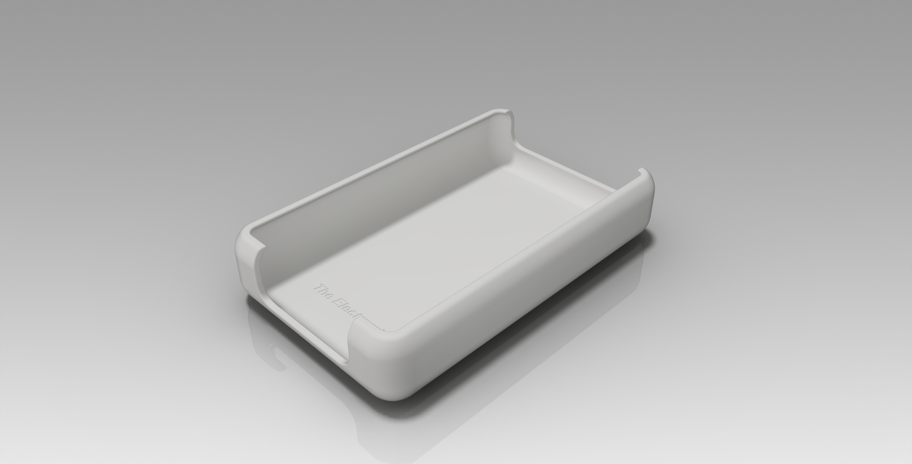
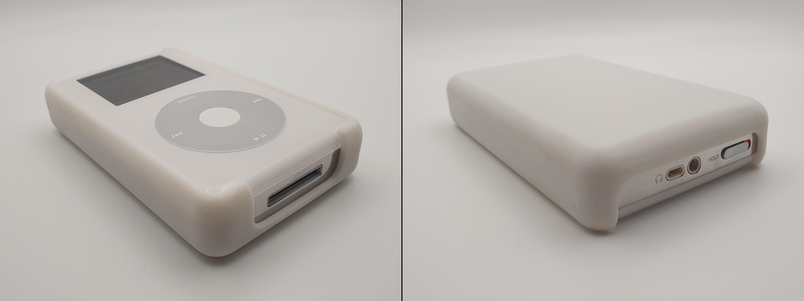

# TEV-AAPL-IPOD-4-CASE-00001-iPod 4th Generation Thick Case
## Overview

This is a 3D-printable case for the 4th Generation iPod with Thick Back Plate. It is made available free of charge under the GPL v3 license (see LICENSE), though if you find the work useful and wish to donate to show your appreciation, you may do so via [buymeacoffee](https://buymeacoffee.com/theelectronvault).

Note: As this is a form-fitting case that clips around the sides of the device, in order to prevent nuisance rattling, tolerances for the open face rim were made quite tight. Thus, depending on your printer's dimensional accuracy, the rim overhang may cause difficulty in installation. Some post-print adjustments of this rim with a file/sandpaper should be expected.

## Disclaimer
The information contained in this repository has been generated via reverse-engineering of publicly available material, and is provided without warranty or guarantee of accuracy. [The Electron Vault](https://www.theelectronvault.com/) is not responsible for any losses or damages caused to equipment as a consequence of the information contained in this repository or associated documents.
