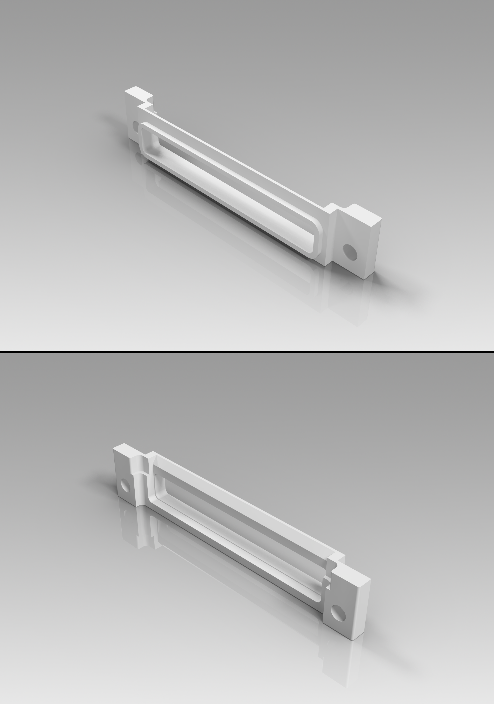

# iPod 4th Generation Dock Connector Bezel

## Overview
This is a 3D-printable Dock Connector Bezel for the 4th Generation iPod. Due to the feature sizes, this is likely to be more suited for stereolithographic/resin printing. It is made available free of charge under the GPL v3 license (see LICENSE), though if you find the work useful and wish to donate to show your appreciation, you may do so via [buymeacoffee](https://buymeacoffee.com/theelectronvault).

## Disclaimer
The information contained in this repository has been generated via reverse-engineering of publicly available material, and is provided without warranty or guarantee of accuracy. [The Electron Vault](https://www.theelectronvault.com/) is not responsible for any losses or damages caused to equipment as a consequence of the information contained in this repository or associated documents.

